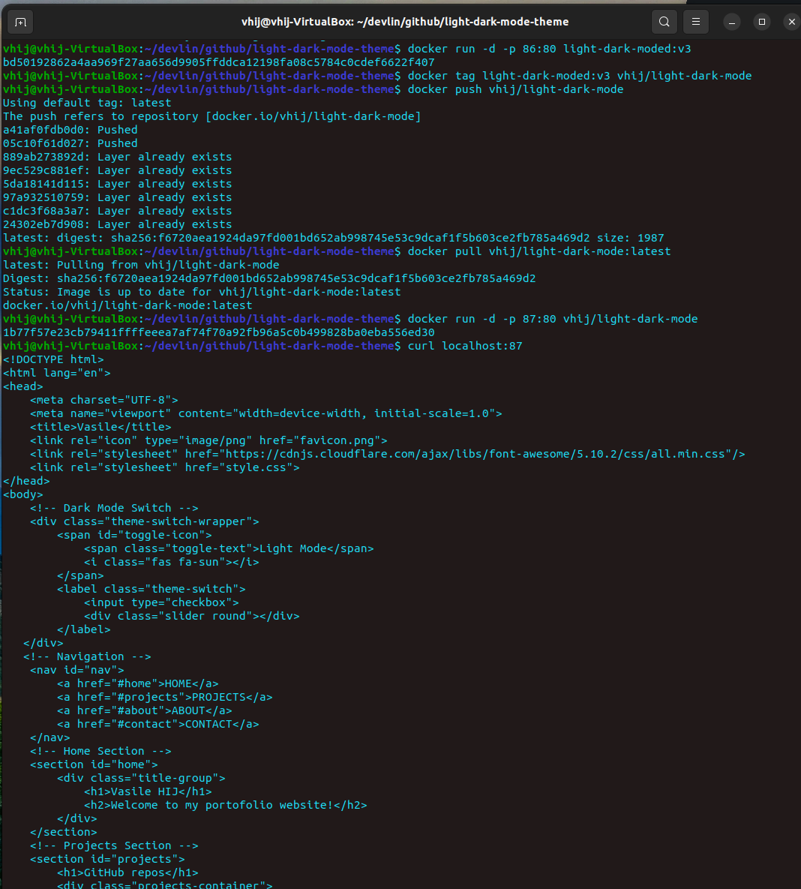
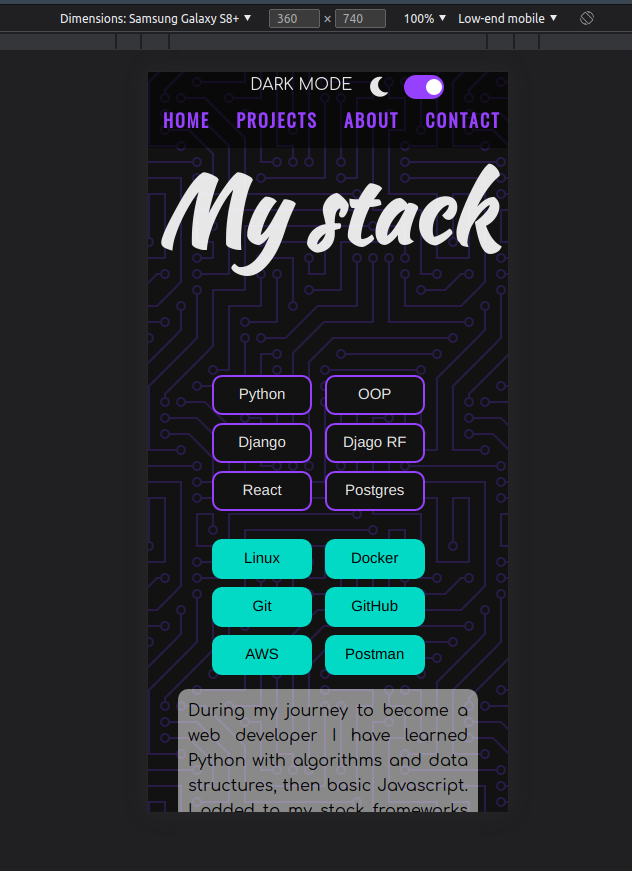

# Light and Dark Mode
The project consists in a static webpage that have been implemented the light/dark switch mode; additionally, navigation bar, buttons, images and a contact page are added to display the functionality of switching light/dark mode.

## Stack
 - javascript
 - docker 

### Features of javascript
- toggle dark/light mode
- infinite scroll
- local storage on browser is used to retain the user option, so it will be used by default when the page it will be open next time. 

### Features of docker
 - dockerfile make a container that can run the html page from docker
 
 
## Download the image from DockerHub
 >`$ docker login`

 > `$ docker pull vhij/light-dark-mode:latest`

 > `$ docker run -d -p 80:80 vhij/light-dark-mode`

 > `$ curl localhost:80`
 
 or copy `localhost:80` in your browser to visualize the beauty of css page.

## AWS Amplify
- CI/CD is made by using `main` branch of this repository to AWS Amplify. For routing I have used AWS Route 53 and `nameserver` was added to my hostname provider to acces Amplify using my name [Vasile Hij](https://www.vasilehij.com).

## Extra
 - adaptive for any browser size
 ---
# Frontend

## HOME light mode

## HOME dark mode

## PROJECTS part 1

## PROJECTS part 2

## ABOUT

## CONTACT

## DOCKER TEST SAMPLE

## Small display

