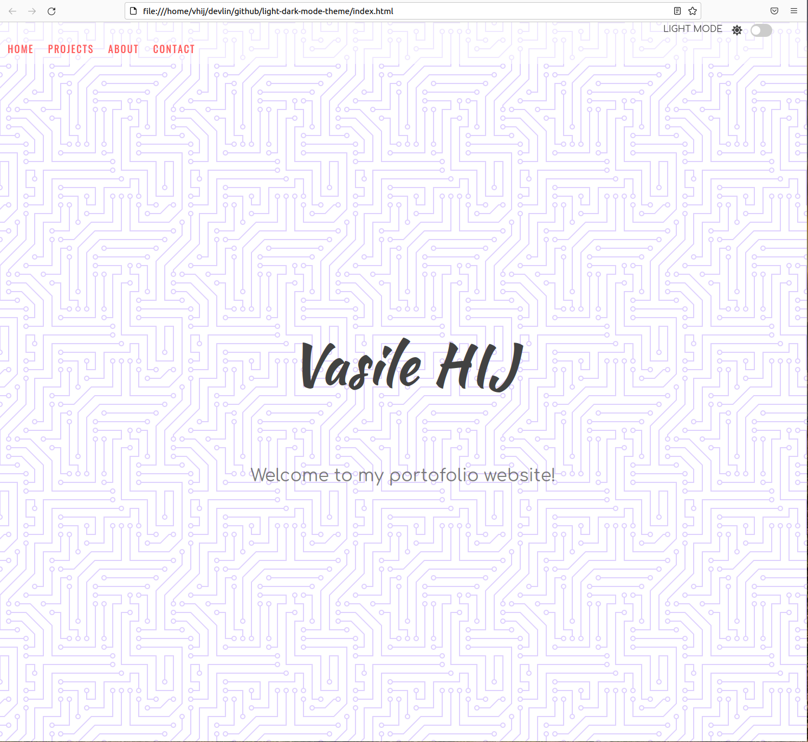
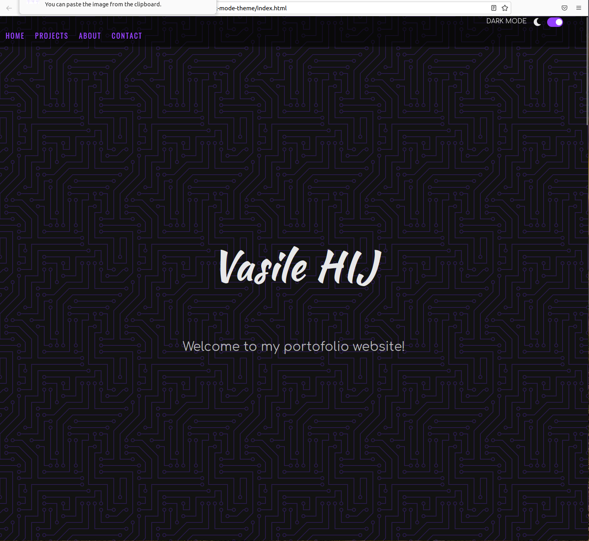
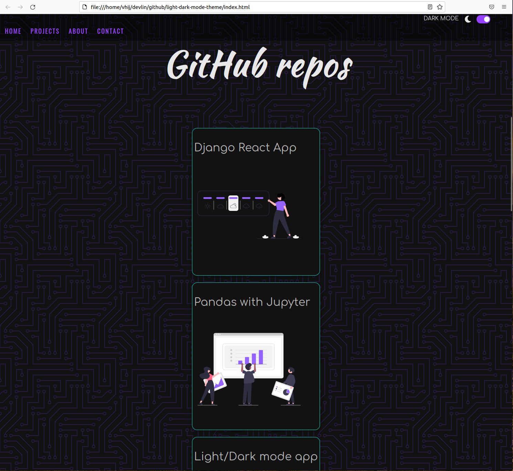
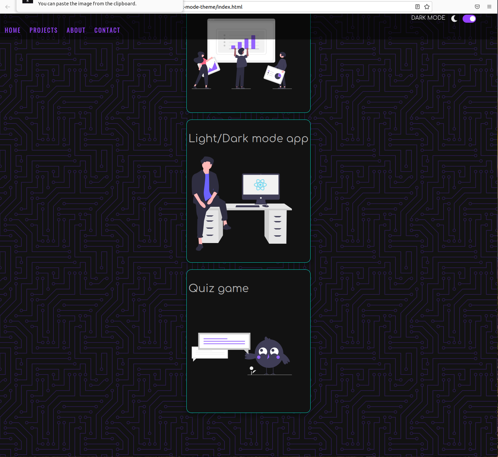
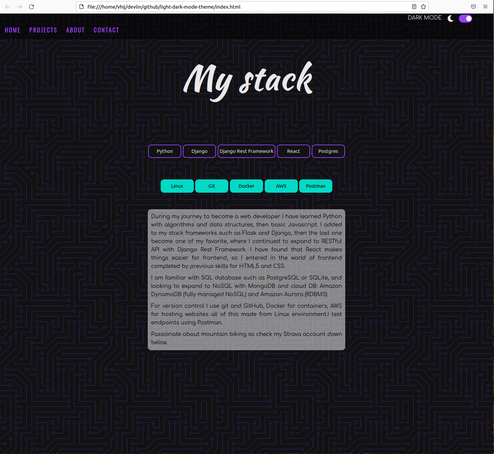
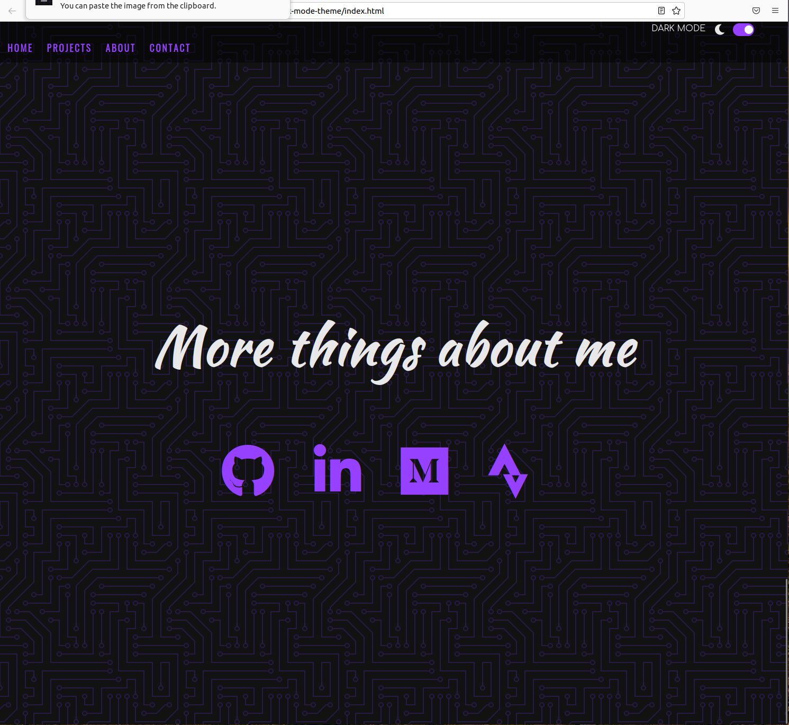

# Light and Dark Mode
The project consists in a static webpage that have been implemented the light/dark switch mode; additionally, navigation bar, buttons, images and a contact page are added to display the functionality of switching light/dark mode.

## Stack
 - javascript 

## Features
- toggle dark/light mode
- infinite scroll
- local storage on browser is used to retain the user option, so it will be used by default when the page it will be open next time. 

## Extra
 - adaptive for any browser
 
## Frontend

